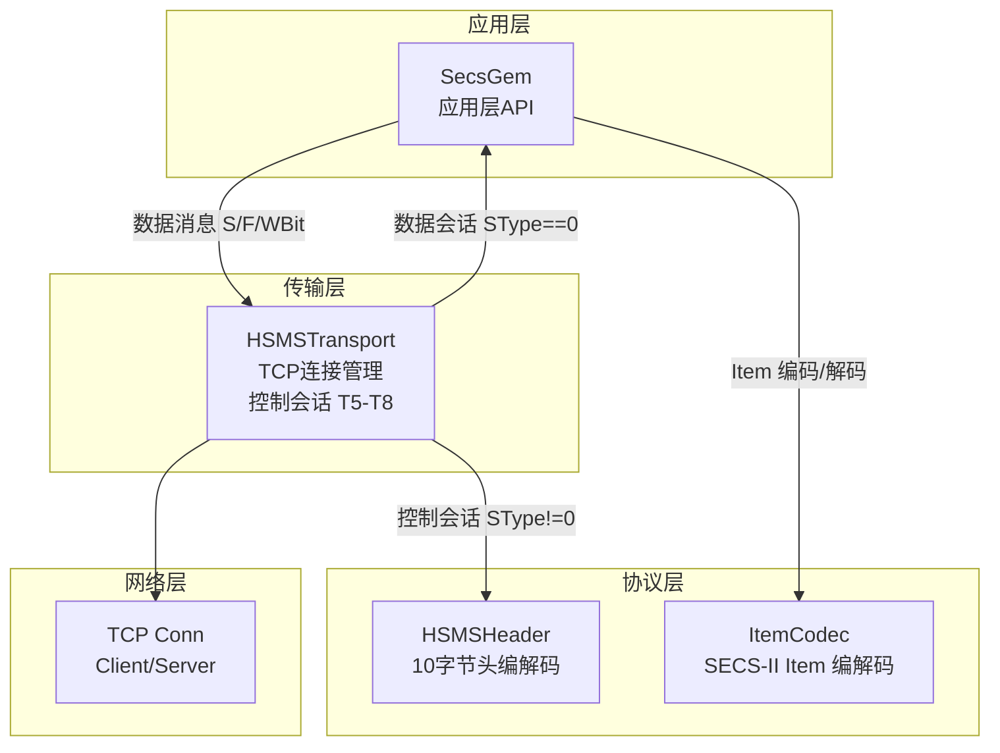

# Secs4Go 架构分析与 secs4net-base 对比

## 一、设计理念梳理

根据你的描述，整体分层架构如下：



**核心设计原则**：
1. **HSMS 层**：解析 HSMS 头部 → 判断 SType → 控制会话在本层处理完毕
2. **数据会话**：SType==0 → 交给上层 SecsGem → Item 编解码在 SecsGem 层完成
3. **职责清晰**：Transport 管连接和控制消息，SecsGem 管业务消息

---

## 二、当前 Secs4Go 项目结构

```
secs4go/
├── types.go              # 基础类型：ItemType, PType, SType, ConnectionState
├── config.go             # Config 配置结构
├── logger.go             # Logger 接口 + 默认/文件实现
├── hsms_header.go        # HSMSHeader 10字节头 编解码
├── hsms_transport.go     # HSMSTransport: TCP连接, 控制会话, T5-T8, 重连, 心跳
├── item.go               # Item 数据模型 + 工厂函数(L, A, B, U1...)
├── secs_item_codec.go    # ItemCodec: Item 的 SECS-II 二进制编解码
├── message.go            # Message DTO + ParseMessage + BuildCompleteFrame
└── secsgem.go            # SecsGem: 应用层API (Send, SendReply, OnMessage)
```

---

## 三、secs4net-base 项目结构

```
src/Secs4Net/
├── SecsFormat.cs           # 格式码枚举
├── MessageType.cs          # 控制消息类型枚举
├── ConnectionState.cs      # 连接状态枚举
├── MessageHeader.cs        # 消息头 record struct (10字节)
├── MessageIdGenerator.cs   # SystemBytes 生成器
├── ISecsConnection.cs      # 连接接口（解耦传输层）
├── HsmsConnection.cs       # HSMS TCP连接实现 (Socket + Pipe)
├── PipeDecoder.cs          # 流式解码器 (System.IO.Pipelines)
├── Item.cs                 # Item 抽象基类
├── Item.Factory.cs         # Item 工厂方法
├── Item.Encode.cs          # Item 编码
├── Item.Decode.cs          # Item 解码
├── Item.List.cs            # ListItem 子类
├── Item.Memory.cs          # MemoryItem 子类 (值类型数组)
├── Item.MemoryOwner.cs     # MemoryOwnerItem 子类 (大数组池化)
├── Item.String.cs          # StringItem 子类 (ASCII/JIS8)
├── SecsMessage.cs          # 消息 DTO
├── PrimaryMessageWrapper.cs# 主消息包装器 (含回复能力)
├── SecsGem.cs              # 应用层核心
├── SecsGemOptions.cs       # 配置选项
├── SecsException.cs        # 异常类型
├── ISecsGemLogger.cs       # 日志接口
└── Extensions/             # 扩展方法
```

---

## 四、关键差异对比

### 4.1 Item 数据模型

| 维度 | Secs4Go (当前) | secs4net-base |
|------|---------------|---------------|
| 设计 | 单一 struct + `interface{}` Value | 抽象基类 + 多态子类 |
| List | `Value: []*Item` | `ListItem` 子类，含 `Item[]` |
| 数值数组 | `Value: []int16` 等具体切片 | `MemoryItem<T>` 泛型子类 |
| 大数组 | 无池化 | `MemoryOwnerItem<T>` 使用 `IMemoryOwner<T>` 池化 |
| 字符串 | `Value: string` | `StringItem` 子类 |
| 空值 | 无特殊处理 | 预定义 `EmptyL`, `EmptyA` 等单例 |
| 编码 | `EncodeTo(IBufferWriter<byte>)` | `EncodeItem` 返回 `[]byte` |
| 解码 | `DecodeFromFullBuffer` / 流式 | `DecodeItem` 递归 |

**分析**：Go 没有泛型继承，当前的 `interface{}` 设计是合理的 Go 风格。但可以借鉴：
- 空值单例优化
- 大数组的 sync.Pool 池化

### 4.2 消息头编解码

| 维度 | Secs4Go | secs4net-base |
|------|---------|---------------|
| 类型 | `HSMSHeader` struct | `MessageHeader` record struct |
| 字段 | SessionID, HeaderByte2/3, PType, SType, SystemBytes | DeviceId, S, F, ReplyExpected, MessageType, Id |
| 编码 | `Encode() []byte` 分配新切片 | `EncodeTo(IBufferWriter<byte>)` 零拷贝 |
| 解码 | `DecodeHeader(data) HSMSHeader` | `Decode(span, out header)` |

**分析**：secs4net 的 `IBufferWriter` 模式减少分配。Go 中可用 `io.WriterAt` 或直接写入预分配 buffer。

### 4.3 传输层架构

| 维度 | Secs4Go | secs4net-base |
|------|---------|---------------|
| 接口 | 无接口，直接 struct | `ISecsConnection` 接口 |
| 读取 | `receiveLoop` 直接 `io.ReadFull` | `Pipe` + `PipeDecoder` 流式处理 |
| 控制/数据分离 | `OnMessage` 回调 + `ctrlHandler` | `Channel<MessageHeader>` + `Channel<(header, Item)>` |
| 发送锁 | 无显式锁 | `SemaphoreSlim` 互斥发送 |
| T8 | 写入时 `SetWriteDeadline` | 读取时独立 Timer |

**分析**：secs4net 的 Pipe 模式在 C# 中很高效，但 Go 的 `bufio.Reader` + `io.ReadFull` 已经足够。控制/数据消息的 Channel 分离是值得借鉴的设计。

### 4.4 应用层

| 维度 | Secs4Go | secs4net-base |
|------|---------|---------------|
| 主消息处理 | 回调 `OnMessage(func(*Message))` | `IAsyncEnumerable<PrimaryMessageWrapper>` |
| 回复关联 | `sync.Map` + `chan replyResult` | `ConcurrentDictionary` + `TaskCompletionSource` |
| S9Fx 处理 | 在 `handleDataMessage` 中检查 | 在 `ProcessDataMessageAsync` 中检查 |
| 消息编码 | `EncodeItem` → `BuildCompleteFrame` | `EncodeMessage` 静态方法，预分配 buffer |

### 4.5 流式解码 (PipeDecoder)

secs4net 的 `PipeDecoder` 是一个亮点设计：
- 使用 `System.IO.Pipelines` 实现零拷贝流式解码
- 支持 chunked 数据：当数据不完整时，等待更多数据到达
- 使用 `stack` 解码嵌套 List
- 控制消息和数据消息分别输出到不同 Channel

**Secs4Go 当前方案**：`receiveLoop` 中先读 4 字节长度 → 读完整帧 → 解码。这是标准的帧定界方案，在 Go 中已经足够高效。

---

## 五、可借鉴的改进点

### 5.1 高优先级

1. **控制/数据消息 Channel 分离**
   - 当前：`ctrlHandler` 和 `dataHandler` 回调混在 `receiveLoop` 中
   - 改进：使用 `chan HSMSHeader` 分离控制消息，`chan struct{header, data}` 分离数据消息
   - 好处：更清晰的职责划分，避免回调地狱

2. **Message.Name 字段**
   - 当前：Message 没有 Name 字段
   - secs4net：`SecsMessage.Name` 用于日志和调试
   - 改进：添加 `Name string` 字段，提升可读性

3. **发送互斥锁**
   - 当前：`transport.Send()` 没有写入互斥
   - secs4net：使用 `SemaphoreSlim` 确保发送原子性
   - 改进：添加 `sync.Mutex` 保护 `conn.Write`

### 5.2 中优先级

4. **空 Item 单例**
   - 预定义 `EmptyList`, `EmptyBinary`, `EmptyASCII` 等，减少分配

5. **MessageIdGenerator 独立**
   - 当前：SystemBytes 生成在 `HSMSTransport.NextSystemBytes()`
   - 可考虑独立为 `IDGenerator`，支持自定义策略

6. **SecsException 结构化**
   - 当前：`SecsException` 未实现
   - secs4net：区分 T3 超时、SxF0、S9Fx 等不同异常类型
   - 改进：定义 `SecsError` 类型，包含原始消息和错误码

### 5.3 低优先级

7. **SML 扩展** - 已有 `sec4go.extension/sml`
8. **JSON 序列化** - 参考 `Secs4Net.Json`
9. **Benchmark 测试** - 参考 `test/Benchmarks`

---

## 六、总结

Secs4Go 当前的架构已经很好地实现了你描述的设计理念：
- HSMS 层处理控制会话
- 数据会话交给 SecsGem 层处理 Item 编解码
- 分层清晰，职责明确

与 secs4net-base 相比，主要差异在于语言特性（Go 的 interface{} vs C# 泛型），但核心设计理念是一致的。可以借鉴的改进主要集中在：
1. 控制/数据消息的 Channel 分离
2. 发送互斥锁
3. 结构化异常处理
