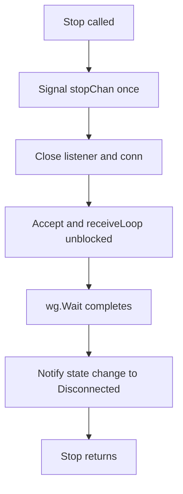

# passive(server) 模式 Stop 前无客户端连接时端口仍处于 LISTEN 的问题分析与修复方案

## 现象
在 passive(server) 模式下，客户端尚未连接（即服务端 goroutine 阻塞在 `Accept`）时调用 [`HSMSTransport.Stop()`](../secs4go/hsms_transport.go:142)，会出现以下至少一种现象：
- `Stop()` 卡住（进程无法退出），或
- Stop 返回但 OS 层面观察端口仍处于 LISTEN（通常对应 Stop 卡住或资源关闭顺序不当）。

## 术语澄清：Listen 成功 vs 有客户端连接
- Listen 成功：`net.Listen(tcp, addr)` 成功返回，端口已被绑定并进入 LISTEN；**此时可能没有任何客户端连接**。
- Accept 成功：`listener.Accept()` 返回了一个 `net.Conn`；**此时才表示有客户端完成了 TCP 连接**。

因此你提议的 passive 模式新增中间状态 `Listening` 是合理的：它表达“端口在监听但尚无 TCP 连接”。

## 根因定位（基于当前代码）
关键链路在 [`HSMSTransport.Start()`](../secs4go/hsms_transport.go:77) -> passive 分支：
- Start passive 会先调用 [`HSMSTransport.Listen()`](../secs4go/hsms_transport.go:327) 创建 `net.Listener` 并绑定端口。
- 然后 `wg.Add(1)` 启动 [`HSMSTransport.handleConnections()`](../secs4go/hsms_transport.go:372)。
- `handleConnections()` 内部再次调用 `Listen()`，随后在 [`HSMSTransport.Accept()`](../secs4go/hsms_transport.go:348) 中阻塞于 `t.listener.Accept()`。

Stop 的关键顺序在 [`HSMSTransport.Stop()`](../secs4go/hsms_transport.go:142)：
1) 先 `close(t.stopChan)`
2) 立即 `t.wg.Wait()` 等待所有后台协程退出
3) **最后** 才调用 [`HSMSTransport.Close()`](../secs4go/hsms_transport.go:556) 关闭 `listener/conn`

问题点：
- `handleConnections()` 阻塞在 `Accept()`，仅关闭 `stopChan` 并不能打断 `Accept()`；因此 `wg.Wait()` 会一直卡住。
- `listener` 直到 Stop 末尾才被 Close 关闭，导致端口在 Stop 期间持续处于 LISTEN。

## 伴随风险（目前实现还存在的生命周期缺陷）
1) Stop 非幂等：再次调用 Stop 会对同一个 `stopChan` 二次 `close`，直接 panic（见 [`HSMSTransport.Stop()`](../secs4go/hsms_transport.go:142)）。
2) 停止过程中可能错误重启监听：[`HSMSTransport.handleDisconnect()`](../secs4go/hsms_transport.go:777) 在 passive 模式下会启动 `handleConnections()` 重新监听；但它在启动后才检查 `stopChan`，Stop 过程中可能仍然触发“重开监听”的竞态。
3) [`HSMSTransport.Close()`](../secs4go/hsms_transport.go:556) 以 `state==StateDisconnected` 作为 early-return 条件，未来一旦出现 `state 已断开但 listener/conn 尚未彻底清理` 的竞态，会导致资源泄漏风险更高。

## 目标语义（你已确认）
- Stop 必须优雅退出：
  - 可能存在已连接客户端（甚至 Selected）
  - 必须退出所有 goroutine（`wg.Wait()` 不得永久阻塞）
  - 必须释放端口（LISTEN 消失）
- Stop 必须幂等（重复调用不 panic）
- Stop 后必须支持再次 Start 重新监听同一端口
- passive(server) 模式新增中间状态：
  - Listen 成功：`Disconnected -> Listening`
  - Accept TCP 成功：`Listening -> Connected`
  - Select 后：`Connected -> Selected`
  - Stop/断开：`* -> Disconnected`

## 修复方案（推荐：最小侵入 + 语义清晰）
核心思想：
1) **Stop 必须先关闭 listener/conn 以打断阻塞点，再等待 goroutine 退出**
2) Stop/停止期间必须有“停止中”保护，避免触发 passive 自动重开监听/active 自动重连
3) 通过新增 `StateListening` 让 passive 生命周期回调语义更清晰

### A. 新增 `StateListening`（保持旧枚举数值兼容）
在 [`ConnectionState`](../secs4go/types.go:83) 增加一个新枚举 `StateListening`。
- 为避免影响旧值的数值（兼容性更好），建议将 `StateListening` **追加到 const 末尾**，并在 `String()` 中新增分支。
- 语义层面不依赖枚举数值顺序，只要回调触发的 old/new 正确即可。

### B. passive 生命周期：由 `handleConnections` 统一负责 Listen+Accept
当前 passive 启动存在“双 Listen”（Start 里 Listen + handleConnections 里 Listen）。建议收敛职责（推荐）：
- [`HSMSTransport.Start()`](../secs4go/hsms_transport.go:77) 在 passive 分支中：
  - **不直接调用** `Listen()`
  - 只启动 `handleConnections()`（其内部负责 Listen+Accept）
- [`HSMSTransport.handleConnections()`](../secs4go/hsms_transport.go:372) 每轮：
  1) 调用 `Listen()` 成功后：设置状态 `Listening` 并触发 `Disconnected/Disconnected? -> Listening`（见下面的回调策略）
  2) 调用 `Accept()`：成功后设置状态 `Connected` 并触发 `Listening -> Connected`
  3) 单连接模式：Accept 成功后退出，由 `handleDisconnect()` 在断开时重新拉起下一轮

> 说明：状态回调 oldState 的来源需要统一：要么在设置状态前读取 prevState；要么用固定转移（例如 Listen 成功时从 Disconnected 进入 Listening）。实现时会在 code 模式中定一个一致策略。

### C. Stop 的顺序调整（打断 Accept/read，保证 wg.Wait 不卡住）
对 [`HSMSTransport.Stop()`](../secs4go/hsms_transport.go:142) 调整为：
1) 读取当前 state/conn 是否 Selected，若是则尝试发送 `Separate.req`（失败忽略）
2) 幂等关闭 stop 信号：`stopOnce.Do(close(stopChan))`
3) **立即关闭资源以解阻塞**：关闭 `listener`（打断 `Accept`）+ 关闭 `conn`（打断 `ReadHSMSFrame`）
4) `wg.Wait()`
5) 统一做一次状态收敛与回调：将 `Listening/Connected/Selected -> Disconnected`（只触发一次）

### D. Stop 幂等 + 支持二次 Start
引入 per-lifecycle 的停止控制字段：
- 在 [`HSMSTransport`](../secs4go/hsms_transport.go:26) 增加：
  - `stopOnce sync.Once`
  - `stopping bool`（或 `atomic.Bool`）

并在 [`HSMSTransport.Start()`](../secs4go/hsms_transport.go:77) 中：当从 `StateDisconnected` 启动新一轮生命周期时，重建：
- `stopChan = make(chan struct{})`
- `stopOnce = sync.Once{}`
- `stopping = false`
- `readyChan` 是否需要重建：若外部会复用 `ReadyChan()` 等待下一次 select，建议在 Start 时重建（否则 ReadyChan 可能已被写过且无人消费，造成语义混乱）。实现时会评估是否需要。

### E. 停止期间禁止重开监听/重连
修改 [`HSMSTransport.handleDisconnect()`](../secs4go/hsms_transport.go:777)：
- 函数开头先判断是否 stopping/stopChan 已关闭；若是：
  - 只清理资源（关闭 conn）
  - **不**触发 `notifyStateChange`
  - **不**启动 passive 的 `handleConnections()`
  - active 模式也不触发 `reconnectChan`

### F. Close 的资源语义修正
将 [`HSMSTransport.Close()`](../secs4go/hsms_transport.go:556) 调整为：
- **永远尝试关闭资源**：若 `listener!=nil` 则 Close；若 `conn!=nil` 则 Close；不以 `state` 作为 early-return 条件
- `state` 的转换与 `notifyStateChange` 由 Stop/handleDisconnect 统一负责，Close 只管资源

## 状态机与回调触发时机（含 `StateListening`）
基于 [`ConnectionState`](../secs4go/types.go:83)：
- `Disconnected`：已停止，且无 listener/conn
- `Listening`：passive 端口已绑定并监听中，无 TCP conn
- `Connected`：TCP 已连接（Not Selected）
- `Selected`：HSMS Select 完成

回调触发建议：
- passive：Listen 成功后触发 `Disconnected -> Listening`
- passive：Accept 成功后触发 `Listening -> Connected`
- passive：收到 `Select.req` 并响应后触发 `Connected -> Selected`（目前已有逻辑，见 [`handleControlInternal()`](../secs4go/hsms_transport.go:686)）
- Stop：`Listening/Connected/Selected -> Disconnected`（仅一次）
- 非 Stop 断开：`Connected/Selected -> Disconnected`，随后 passive 自动重启一轮并再次进入 `Listening`

## 回归验证设计
### 1) 无客户端连接时 Stop
- Start passive
- 不启动 client，直接调用 Stop
- 断言：Stop 返回且端口可立即重新绑定（同进程中 `net.Listen` 同地址成功）

### 2) 已连接未 Selected / 已 Selected 时 Stop
- 启动 client 连上服务端
- 覆盖两种情况：
  - client 只 TCP 连接不发 Select
  - client 发 Select 完成 Selected
- 调用 Stop
- 断言：Stop 返回；server 端口释放；client 侧读到断开或收到 Separate.req（视实现而定）

### 3) Stop 幂等 + 二次 Start
- 连续调用 Stop 2 次不 panic
- Stop 后再次 Start 能重新监听并接受连接

## 预期改动清单（实施时）
- 修改 [`ConnectionState`](../secs4go/types.go:83) 与 `String()`：新增 `StateListening`
- 修改 [`HSMSTransport.Start()`](../secs4go/hsms_transport.go:77)：
  - passive 分支不再重复 Listen
  - 重置 stop 生命周期控制（stopChan/stopOnce/stopping/可能的 readyChan）
- 修改 [`HSMSTransport.handleConnections()`](../secs4go/hsms_transport.go:372)：负责 Listen+Accept，并发出 Listening/Connected 的状态回调
- 修改 [`HSMSTransport.Accept()`](../secs4go/hsms_transport.go:348)：状态从 Listening -> Connected；并保证 stop 时能尽快返回
- 修改 [`HSMSTransport.Stop()`](../secs4go/hsms_transport.go:142)：幂等 + 先关闭资源打断阻塞，再 wg.Wait
- 修改 [`HSMSTransport.handleDisconnect()`](../secs4go/hsms_transport.go:777)：stop 期间不重启监听/不重连
- 修改 [`HSMSTransport.Close()`](../secs4go/hsms_transport.go:556)：只负责资源关闭，不以 state early-return
- 可选：新增测试文件 [`secs4go/hsms_transport_test.go`](../secs4go/hsms_transport_test.go:1) 覆盖端口释放、幂等 Stop、二次 Start

## 流程图（Stop 修复后的关键路径）

