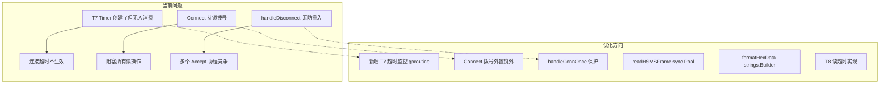

# HSMSTransport 优化计划

> 文件: [`core/hsms_transport.go`](../core/hsms_transport.go)
> 分析日期: 2026-06-17

---

## 一、P0 — 逻辑缺陷/Bug

### 1. T7 超时从未生效（缺少消费 goroutine）

[`t7Timer`](../core/hsms_transport.go:48) 在构造函数中创建，[`resetT7Locked()`](../core/hsms_transport.go:942) 中 Reset，**但整个文件中没有任何 goroutine 消费 `t7Timer.C`**。这意味着 TCP 连接建立后（`Connected` 状态），如果对端不在 T7 秒内发送 `Select.req`，连接**永远不会被主动断开**，违反 HSMS 规范。

**修复方案**：在 `Start()` 中增加一个专门的 T7 超时监控 goroutine。

### 2. [`Connect()`](../core/hsms_transport.go:341) Select 失败后未清理连接

[`Connect()`](../core/hsms_transport.go:341) 在第 345 行成功建立 TCP 连接并启动了 [`receiveLoop()`](../core/hsms_transport.go:359)，但如果第 365 行 [`SendControlAndWait()`](../core/hsms_transport.go:365) 失败（如 T6 超时），**`t.conn` 未被关闭、`receiveLoop` 仍在运行**。调用者拿到错误后可能重试 `Connect()`，导致旧 `receiveLoop` 与新连接并存。

**修复方案**：`SendControlAndWait` 失败时调用 [`closeResources()`](../core/hsms_transport.go:665) 或 `handleDisconnect()` 清理。

### 3. 服务端 [`handleDisconnect()`](../core/hsms_transport.go:953) 可能重复派生 goroutine

第 992-994 行，每次 `handleDisconnect` 都 `go t.handleConnections()`，但没有防重入保护。如果短时间内多次断连（如心跳失败后又读到错误），可能同时存在多个 [`handleConnections()`](../core/hsms_transport.go:451) 协程竞争 `Accept()`。

**修复方案**：增加一个 `handleConnOnce sync.Once` 或用原子标志确保只启动一次。

---

## 二、P1 — 并发安全/资源泄漏

### 4. [`Connect()`](../core/hsms_transport.go:341) 在持锁期间阻塞式 TCP 拨号

第 345-347 行，`net.DialTimeout` 可能阻塞长达 T5（默认 10s），期间 [`t.mu.Lock()`](../core/hsms_transport.go:342) 一直持有，**所有需要读锁的操作**（[`IsSelected()`](../core/hsms_transport.go:628)、[`GetState()`](../core/hsms_transport.go:635)、[`RemoteAddr()`](../core/hsms_transport.go:642) 等）全部被阻塞。

**修复方案**：在锁外完成 TCP 拨号，拨号成功后再获取锁设置 `t.conn`。

### 5. [`heartbeatLoop()`](../core/hsms_transport.go:306) Timer 泄漏

每次循环第 311 行创建 `time.NewTimer`，当 `<-t.stopChan` 被选中时直接 `return`，**Timer 未 Stop**。虽然 Timer 最终会触发并被 GC，但在高频 Stop/Start 场景下会有不必要的内存占用。

**修复方案**：在 `return` 前调用 `heartbeatTimer.Stop()`。

### 6. [`autoReconnectLoop()`](../core/hsms_transport.go:258) 使用 `time.After` 泄漏

第 285 行 `time.After(t.config.T5)` 创建的 channel 在被 `stopChan` 抢先选中后无法被 GC（直到 T5 时间过去）。

**修复方案**：改用 `time.NewTimer`，并在 `return` 前 `Stop()`。

### 7. [`enqueueWrite()`](../core/hsms_transport.go:509) 每次调用时 `ConnDone()` 临时分配

[`ConnDone()`](../core/hsms_transport.go:222) 在 `connDone == nil` 时每次调用都创建一个新的 `chan struct{}` 并立即 close（第 226-228 行）。`enqueueWrite` 是热路径，每次发送消息都会触发。

**修复方案**：缓存一个包级别的 `closedDoneChan`，`ConnDone()` 在 nil 时返回它。

### 8. T8（网络字符间超时）未实现

第 710 行 T8 的 `SetReadDeadline` 被注释掉了。HSMS 规范要求 T8 检测半开连接——如果对端突然消失（不发 FIN），`readHSMSFrame` 会永远阻塞。

**修复方案**：取消注释并确认实现，或者在 `readHSMSFrame` 外层设置读超时。

---

## 三、P2 — 性能优化

### 9. [`readHSMSFrame()`](../core/hsms_transport.go:1068) 每帧两次堆分配

第 1070 行 `make([]byte, 4)` 和第 1083 行 `make([]byte, frameLen)` 在每次读帧时分配。高吞吐场景下会产生大量 GC 压力。

**修复方案**：使用 `sync.Pool` 复用读缓冲区，或者使用 `bufio.Reader` 减少小分配。

### 10. [`BuildCompleteFrame()`](../core/message.go:80) 三次分配

`header.Encode()` 分配 10 字节 → `make([]byte, 4)` 分配长度前缀 → 两次 `append` 可能再次分配。

**修复方案**：一次分配 `4 + 10 + len(itemData)` 字节，直接填充。

### 11. [`formatHexData()`](../core/hsms_transport.go:1054) 分配 N 个字符串再 Join

每个字节 `fmt.Sprintf("%02X", b)` 分配一个字符串，然后 `strings.Join`。

**修复方案**：改用 `strings.Builder` + `fmt.Fprintf`，或者用预计算的 hex 表直接索引。

### 12. 日志路径无条件重建完整帧

[`logReceivedControl()`](../core/hsms_transport.go:1042) 和 [`logSendControl()`](../core/hsms_transport.go:1048) 每次都调用 [`BuildCompleteFrame()`](../core/message.go:80) 重建帧数据再 hex dump。当日志级别高于 Info 时这是纯浪费。

**修复方案**：先检查日志级别，或在 [`SendControl()`](../core/hsms_transport.go:554) 中复用已有的 `frameData`。

### 13. [`enqueueWrite()`](../core/hsms_transport.go:509) 每次创建 `errCh`

每次发送都 `make(chan error, 1)`，高频调用时增加 GC 压力。

**修复方案**：使用 `sync.Pool` 复用 `writeRequest` 或 `errCh`。

---

## 四、P3 — 代码质量/可维护性

### 14. Channel 容量魔法数字

[`ctrlChan`](../core/hsms_transport.go:114) `8`、[`dataChan`](../core/hsms_transport.go:115) `64`、[`writeChan`](../core/hsms_transport.go:116) `16` 等硬编码散落各处。

**修复方案**：提取为命名常量。

### 15. [`drainChannels()`](../core/hsms_transport.go:817) 使用 `goto`

第 824 行 `goto drainOthers` 可以用标签化 `for` 循环或函数拆分替代，提升可读性。

### 16. [`handleControlInternal()`](../core/hsms_transport.go:866) 状态转换逻辑重复

`STypeSelectReq`、`STypeDeselectReq` 等分支的 Lock → 状态变更 → Unlock → notifyStateChange 模式重复出现。

**修复方案**：提取 `transitionState(newState ConnectionState)` 辅助方法。

### 17. `stopping` 标志可用 `atomic.Bool`

[`stopping`](../core/hsms_transport.go:61) 字段在 [`Stop()`](../core/hsms_transport.go:179) 中设为 true，在 [`handleDisconnect()`](../core/hsms_transport.go:953) 中读取，当前用 `mu.Lock`/`mu.RLock` 保护。用 `atomic.Bool` 更轻量且语义更清晰。

### 18. 缺少 `Start()` 防重入保护

如果连续调用两次 `Start()` 且第一次还未将状态改为非 Disconnected，会重复创建 consumer/writer goroutine。

**修复方案**：增加 `started` 原子标志或在入口检查。

---

## 架构概览

---

## 实施顺序建议

1. **P0 优先**：修复 T7 超时、Connect 清理、handleDisconnect 防重入 — 这些是真正的正确性 bug
2. **P1 跟进**：Connect 持锁优化、Timer 泄漏修复、T8 实现 — 并发安全和资源管理
3. **P2 按需**：缓冲池、hex 格式化优化、日志路径优化 — 性能敏感场景再做
4. **P3 按需**：代码质量改进 — 日常维护中逐步完成
