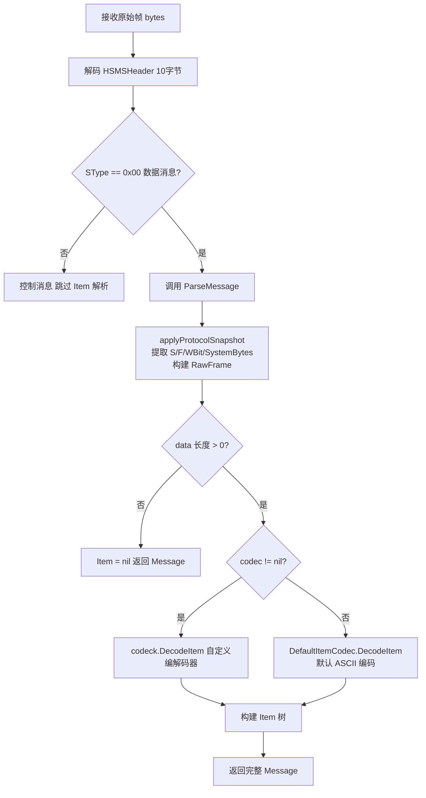
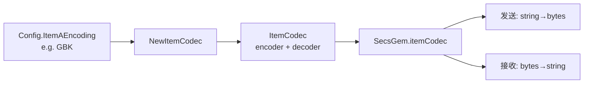

# Message DTO 梳理分析

## 一、Message 结构体概述

[`Message`](secs4go/message.go:13) 是 SECS-II 协议数据消息的核心 DTO，承载了一条完整的 SECS 消息所需的所有信息：

| 字段 | 类型 | 说明 |
|------|------|------|
| `Stream` | `uint8` | 消息流编号 (1-127)，SECS-II 的 Stream |
| `Function` | `uint8` | 消息功能号，SECS-II 的 Function |
| `WBit` | `bool` | 等待位，表示是否需要对方回复 |
| `SystemBytes` | `uint32` | 系统字节，用于请求-回复关联追踪 |
| `Item` | `*Item` | 消息体/数据项，SECS-II 的层级数据结构 |
| `RawFrame` | `[]byte` | 原始完整帧（4B长度头 + 10B HSMS头 + 数据体） |
| `Timestamp` | `time.Time` | 消息时间戳 |

### 1.1 Message 的构造方式

有两种构造路径：

**路径A：应用层主动构造（发送方向）**

通过工厂函数 [`NewMessage()`](secs4go/message.go:24) + 链式调用：

```go
msg := NewMessage(1, 1).
    WithWBit(true).
    WithItem(L(A("Hello"), U1(42)))
```

**路径B：网络层解析构造（接收方向）**

通过 [`ParseMessage()`](secs4go/message.go:78) 从原始字节流解析：

```go
msg, err := ParseMessage(header, data, codec)
```

---

## 二、ParseMessage 完整流程



### 2.1 applyProtocolSnapshot 做了什么

[`applyProtocolSnapshot()`](secs4go/message.go:60) 从 `HSMSHeader` 提取协议层元信息：

- `Stream` = `header.Stream()` → `HeaderByte2 & 0x7F`（高7位）
- `WBit` = `header.WBit()` → `HeaderByte2 & 0x80`（最高位）
- `Function` = `header.Function()` → `HeaderByte3`
- `SystemBytes` = `header.SystemBytes`
- `RawFrame` = `BuildCompleteFrame(header, data)` → 拼接 `4B长度 + 10B头 + data`

### 2.2 codec 参数的来源

在 [`SecsGem`](secs4go/secsgem.go:30) 中，`itemCodec` 通过构造函数注入：

```go
// secs4go/secsgem.go:59
func NewSecsGem(deviceName string, config *Config, codec *ItemCodec) *SecsGem {
    if codec == nil {
        codec = DefaultItemCodec  // 默认 ASCII
    }
    ...
}
```

所有消息的解析都使用同一个 `s.itemCodec` 实例：
- 接收方向：[`handleDataMessage()`](secs4go/secsgem.go:322) → `ParseMessage(header, itemData, s.itemCodec)`
- 回复方向：[`SendAndWait()`](secs4go/secsgem.go:213) → `ParseMessage(reply.header, reply.data, s.itemCodec)`

---

## 三、codec.DecodeItem 核心逻辑详解

### 3.1 SECS-II Item 的二进制格式

每个 Item 在字节流中的编码格式为：

```
[格式字节 1B] [长度字段 1-3B] [数据 N B]
     |              |              |
  type<<2|lenBits   实际数据长度    原始数据
```

**格式字节 Format Byte**（1字节）：
- 高6位 `[7:2]`：ItemType 格式码（如 List=0x00, ASCII=0x20, Binary=0x10 等）
- 低2位 `[1:0]`：长度字段的字节数（01=1字节, 10=2字节, 11=3字节）

### 3.2 DecodeItem 解码流程

[`ItemCodec.DecodeItem()`](secs4go/secs_item_codec.go:220) 的逻辑：

```
Step 1: 读取 formatByte（第1个字节）
        itemType = formatByte >> 2      → 取高6位得到类型码
        lengthBytes = formatByte & 0x03 → 取低2位得到长度字段宽度

Step 2: 读取长度字段（1-3字节，大端序）
        lengthBytes=1 → length = data[1]
        lengthBytes=2 → length = BigEndian.Uint16(data[1:3])
        lengthBytes=3 → length = data[1]<<16 | data[2]<<8 | data[3]

Step 3: 如果是 TypeList → 递归解码子项
        decodeListItem() 循环 itemCount 次，每次递归调用 DecodeItem

Step 4: 非 List 类型 → 切出 itemData = data[headerLen : headerLen+length]
        调用 itemBytesToValue() 按类型转为 Go 值

Step 5: 返回 Item{Type, Value}, consumed字节数, error
```

### 3.3 itemBytesToValue 类型映射

[`itemBytesToValue()`](secs4go/secs_item_codec.go:280) 是类型分发中心：

| ItemType | 输入字节 | 输出 Go 类型 | 转换方式 |
|----------|---------|-------------|---------|
| `TypeList` | - | `nil` | 由外层递归处理 |
| `TypeBinary` | `[]byte` | `[]byte` | 直接透传 |
| `TypeJIS8` | `[]byte` | `[]byte` | 直接透传 |
| **`TypeASCII`** | `[]byte` | `string` | **通过 `c.decodeString()` 转换编码** |
| `TypeBoolean` | `[]byte` | `[]bool` | 每字节非零=TRUE |
| `TypeInt8` | `[]byte` | `[]int8` | 逐字节强转 |
| `TypeInt16` | `[]byte` | `[]int16` | BigEndian 每2字节 |
| `TypeInt32` | `[]byte` | `[]int32` | BigEndian 每4字节 |
| `TypeInt64` | `[]byte` | `[]int64` | BigEndian 每8字节 |
| `TypeUInt8` | `[]byte` | `[]uint8` | 直接透传 |
| `TypeUInt16/32/64` | `[]byte` | `[]uint16/32/64` | BigEndian |
| `TypeFloat32/64` | `[]byte` | `[]float32/64` | IEEE754 BigEndian |

---

## 四、Item.ASCII 的多编码支持（核心重点）

### 4.1 问题背景

SECS-II 协议中 `TypeASCII`（格式码 0x20）用于传输字符串数据。但在半导体设备通信中：
- **欧美设备**：通常使用纯 ASCII 编码
- **中日韩设备**：可能使用 GBK/GB2312/JIS-8 等多字节编码
- **现代设备**：部分支持 UTF-8

字节流中 `TypeASCII` 的数据就是原始字节，**编码语义由设备约定**，协议本身不传输编码信息。

### 4.2 ItemCodec 的编码架构

[`ItemCodec`](secs4go/secs_item_codec.go:31) 通过 `golang.org/x/text/encoding` 实现可配置的编解码：

```go
type ItemCodec struct {
    encodingName string           // 编码名称 如 "GBK", "UTF-8", "ASCII"
    encoder      *encoding.Encoder // 字符串 → 字节（发送时）
    decoder      *encoding.Decoder // 字节 → 字符串（接收时）
}
```

### 4.3 支持的编码

通过 [`NewItemCodec()`](secs4go/secs_item_codec.go:38) 创建，支持：

| 编码名 | 底层实现 | 使用场景 |
|--------|---------|---------|
| `"ASCII"` | `ianaindex.IANA.US-ASCII` | 默认，纯英文设备 |
| `"UTF-8"` | `encoding.Nop`（无转换） | Go 原生 UTF-8 |
| `"GBK"` | `simplifiedchinese.GBK` | 中文设备 |
| `"GB2312"` | `simplifiedchinese.GB18030` | 兼容GB2312的设备 |

### 4.4 编码转换的双向流程

**接收方向（DecodeItem 解码时）**：

```
原始字节 [0xC4 0xE3 0xBA 0xC3] (GBK编码的"你好")
    │
    ▼
decodeString(data)
    │
    ▼
transform.Bytes(c.decoder, data)   ← GBK Decoder
    │
    ▼
Go string "你好"  (UTF-8内存表示)
```

**发送方向（EncodeItem 编码时）**：

```
Go string "你好" (UTF-8内存表示)
    │
    ▼
encodeString(value)
    │
    ▼
transform.Bytes(c.encoder, data)   ← GBK Encoder
    │
    ▼
原始字节 [0xC4 0xE3 0xBA 0xC3] (GBK编码)
```

### 4.5 编码转换在 DecodeItem 中的具体调用链

```
codec.DecodeItem(data)
  └─ itemBytesToValue(TypeASCII, itemData)     // secs_item_codec.go:287
       └─ c.decodeString(itemData)              // secs_item_codec.go:338
            ├─ if c.decoder == nil:
            │    return string(data)            // 无编码器，直接转string
            └─ else:
                 return transform.Bytes(c.decoder, data)  // 按配置编码解码
```

### 4.6 DefaultItemCodec 默认行为

```go
// secs4go/secs_item_codec.go:66
var DefaultItemCodec, _ = NewItemCodec("ASCII")
```

默认使用严格 ASCII 编码。当接收到非 ASCII 字节（如中文 GBK）时，`encoding.ReplaceUnsupported` 会将无法映射的字符替换为 `?`。

---

## 五、关键设计总结

### 5.1 编解码器注入模式



### 5.2 为什么需要 ItemCodec 而不用默认的 DecodeItem

| 场景 | 使用 DefaultItemCodec | 使用自定义 ItemCodec |
|------|----------------------|---------------------|
| 收到纯ASCII字符串 | ✅ 正常解析 | ✅ 正常解析 |
| 收到GBK中文字符串 | ❌ 被替换为 `?` | ✅ 正确解码为中文 |
| 发送中文字符串 | ❌ 乱码 | ✅ 正确编码为GBK字节 |

### 5.3 潜在注意事项

1. **编码不匹配风险**：如果设备发送 GBK 但 ItemCodec 配置为 ASCII，中文字符会丢失（替换为 `?`），且不会报错
2. **TypeBinary 不受编码影响**：`TypeBinary` 和 `TypeJIS8` 的数据始终为原始字节透传，不经过编码转换
3. **encoder 使用了 ReplaceUnsupported**：发送时如果 Go string 包含目标编码不支持的字符，会被替换为 `?`，可能导致数据丢失
