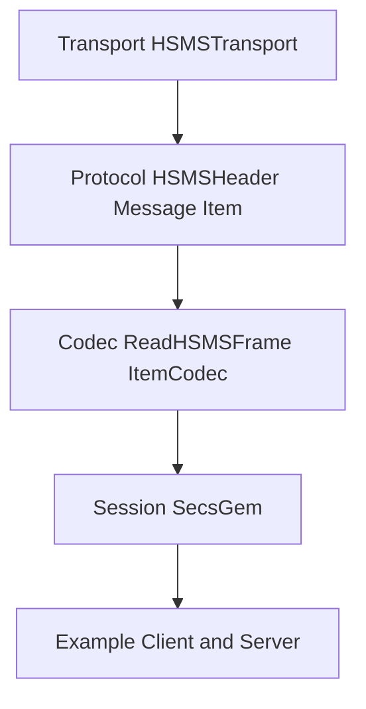

# Secs4Go 项目优化方案（问题清单 + 对应措施版）

## 1. 项目逻辑梳理（先厘清逻辑，再谈优化）

### 1.1 核心层 `secs4go/` 的职责链路

- 传输层：只管连接与会话状态，收发帧，不懂业务语义。入口参考 [`secs4go/hsms_transport.go`](secs4go/hsms_transport.go)。
- 协议对象层：`HSMSHeader` / `Message` / `Item` 只表达协议对象，不依赖传输层。参考 [`secs4go/hsms_header.go`](secs4go/hsms_header.go)、[`secs4go/message.go`](secs4go/message.go)、[`secs4go/item.go`](secs4go/item.go)。
- 编解码层：帧与 `Item` 的编解码、错误处理，不应做静默降级。参考 [`secs4go/codec.go`](secs4go/codec.go)、[`secs4go/secs_item_codec.go`](secs4go/secs_item_codec.go)。
- 会话层：`SecsGem` 负责请求-回复关联、回调分发与外部 API，不应接管 transport 内部状态。参考 [`secs4go/secsgem.go`](secs4go/secsgem.go)。

### 1.2 应用层 `example/` 的职责链路

- `example/` 是“客户端/服务端实例生产应用”，应能独立跑、可配置、可读、可复用。
- 推荐结构：`main.go` 只做 wiring；`handlers` 负责协议处理；`app` 管生命周期；`model` 管设备数据。参考 [`example/server/main.go`](example/server/main.go)、[`example/server/device.go`](example/server/device.go)、[`example/server/publisher.go`](example/server/publisher.go)、[`example/client/main.go`](example/client/main.go)。

## 2. 问题清单（问题 -> 影响 -> 对应措施）

### 2.1 核心层问题清单

1) **会话层边界过重**
- 影响：`SecsGem` 既做门面又接管 transport 细节，边界混乱，后续演进风险高。
- 具体位置与现况：
  - 构造期直接改 transport 内部状态：[`NewSecsGem()`](secs4go/secsgem.go:47) 内部写入 `hsmsConnection.logger` 并注册 [`OnMessage`](secs4go/secsgem.go:64) 回调。
  - 生命周期边界不一致：[`Close()`](secs4go/secsgem.go:76) 仅关闭 reply 等待，不负责 `transport.Stop()`，但 transport 回调已被绑定。
  - 会话层承载额外行为：[`Send()`](secs4go/secsgem.go:104) 内部负责编码、日志、发送、等待回复；接收侧统一转发回调。
  - 默认回复策略内置：[`SendDefaultReply()`](secs4go/secsgem.go:283) 作为兜底存在。
- 风险：
  - 复用风险：外部单独使用 `HSMSTransport` 时，`SecsGem` 的构造行为会覆盖 logger 与回调。
  - 维护风险：生命周期不清晰导致关闭时的资源与回调状态不可预测。
  - 测试风险：`SecsGem` 副作用多，单测隔离成本高。
- 临时措施（低改动）：
  - 明确约定“logger 由应用层统一注入，`SecsGem` 与 transport 共享同一 logger”。
  - 文档化构造期绑定行为，明确 `NewSecsGem` 会绑定回调与 logger，`Close()` 不负责停止 transport。
  - 默认回复保持兜底能力，仅补充说明其使用场景与边界。
- 长期方案与合理性评估：
  - 方案 L1（推荐）：显式 Wiring。`SecsGem` 构造仅保存依赖，不再隐式绑定 transport/logger；由调用方显式 `Attach/Bind` 完成回调注册与 logger 注入。
    - 合理性：副作用可见、职责清晰、便于替换 transport 与单测。
    - 外部复杂度：**增加 1 个显式步骤**，但流程更清晰、可维护性更高。
  - 方案 L2（过渡兼容）：构造期绑定 + 显式选项（`WithAttach`/`WithLogger`）。
    - 合理性：保留现有体验，同时提升可见性。
    - 外部复杂度：默认使用不变，额外理解成本中等。
  - 方案 L3（强一致）：`SecsGem` 成为唯一 owner，负责 `transport.Start/Stop` 生命周期与 logger 注入。
    - 合理性：边界最清晰，但对现有使用方式改动大。
    - 外部复杂度：对新用户更简单，对现有用户迁移成本高。
- 结论：
  - logger 共用是合理的，但**注入点需显式**；回调链路合理，但**绑定时机需可见**；默认回复保留，仅优化细节。

2) **`Message` 字段收敛问题**
- 影响：当前 [`Message`](secs4go/message.go:13) 既承担发送消息输入模型，又承担接收消息快照模型，字段边界不够清楚；其中 [`Header`](secs4go/message.go:14) 与 [`RawData`](secs4go/message.go:20) 对当前应用层使用价值偏低。
- 具体位置与现况：
  - 发送侧主要依赖 [`NewMessage()`](secs4go/message.go:26) 构造的 [`Stream`](secs4go/message.go:15)、[`Function`](secs4go/message.go:16)、[`WBit`](secs4go/message.go:17)、[`Item`](secs4go/message.go:19)。应用层大量按这个方式使用，例如 [`example/client/main.go:89`](example/client/main.go:89)、[`example/server/device.go:487`](example/server/device.go:487)。
  - 接收侧由 [`ParseMessage()`](secs4go/message.go:116) 填充 [`RawFrame`](secs4go/message.go:21)、[`Timestamp`](secs4go/message.go:22) 以及当前仍存在的 [`Header`](secs4go/message.go:14)、[`RawData`](secs4go/message.go:20)。
  - [`Header`](secs4go/message.go:14) 的原始字节可从 [`RawFrame`](secs4go/message.go:21) 的 `4:14` 区间恢复；[`RawData`](secs4go/message.go:20) 可从 `14:` 区间恢复。
  - 当前工程里，`example/` 基本不直接使用 [`msg.Header`](secs4go/message.go:14) 与 [`msg.RawData`](secs4go/message.go:20)；`msg.Header` 直接使用点主要只在 [`secs4go/secsgem.go:274`](secs4go/secsgem.go:274) 的日志兜底逻辑中。
- 风险：
  - 理解风险：调用方不容易区分哪些字段是“发送前要填”，哪些字段是“接收后系统补充”。
  - 冗余风险：`Header` 与 `RawData` 都可从 `RawFrame` 还原，属于重复快照。
  - 演进风险：若后续继续在 [`Message`](secs4go/message.go:13) 叠加调试字段，会使应用层消息对象越来越臃肿。
- 影响范围分析：
  - [`secs4go/message.go`](secs4go/message.go)：需删除 [`Header`](secs4go/message.go:14) 与 [`RawData`](secs4go/message.go:20)，并调整 [`applyProtocolSnapshot()`](secs4go/message.go:74) 与 [`ParseMessage()`](secs4go/message.go:116) 的赋值逻辑。
  - [`secs4go/secsgem.go`](secs4go/secsgem.go)：主要影响 [`logReceivedData()`](secs4go/secsgem.go:271) 的日志兜底路径，当前其使用了 [`msg.Header`](secs4go/secsgem.go:274) 与 [`msg.RawData`](secs4go/secsgem.go:278)。
  - [`secs4go/hsms_transport.go`](secs4go/hsms_transport.go) 与 [`secs4go/codec.go`](secs4go/codec.go)：基本无协议行为改动，transport 仍通过 [`OnMessage()`](secs4go/hsms_transport.go:1002) 上报 `header + itemData`。
  - [`example/`](example/)：当前主要用的是 [`Stream`](secs4go/message.go:15)、[`Function`](secs4go/message.go:16)、[`WBit`](secs4go/message.go:17)、[`SystemBytes`](secs4go/message.go:18)、[`Item`](secs4go/message.go:19)，影响很低。
- 临时措施（低改动）：
  - 先在文档中明确 [`Message`](secs4go/message.go:13) 的主用途是“应用层数据消息对象”。
  - 在未删除字段前，约定 [`Header`](secs4go/message.go:14) 与 [`RawData`](secs4go/message.go:20) 不作为应用层常规依赖字段。
- 长期方案与合理性评估：
  - 方案 M1（当前推荐）：删除 [`Header`](secs4go/message.go:14) 与 [`RawData`](secs4go/message.go:20)，保留 [`RawFrame`](secs4go/message.go:21) 作为唯一原始快照。
    - 合理性：让 `Message` 更收敛，保留应用层真正需要的字段，减少重复状态。
    - 外部复杂度：几乎不增加；若未来确需完整头信息，可从 [`RawFrame`](secs4go/message.go:21) 反解。
  - 方案 M2（折中）：删除 [`RawData`](secs4go/message.go:20)，保留 [`Header`](secs4go/message.go:14)。
    - 合理性：先去除低价值冗余，保留完整协议头快照。
    - 外部复杂度：低，但 `Message` 仍偏胖。
  - 方案 M3（保守）：字段全部保留，只补文档约束。
    - 合理性：兼容性最高。
    - 外部复杂度：最低，但重复状态问题继续保留。
- 结论：
  - 当前方向上，**更推荐把这条问题定义为 `Message` 字段收敛问题**。
  - 若目标是让 [`Message`](secs4go/message.go:13) 更像“应用层消息对象”，则**删除 [`Header`](secs4go/message.go:14) 与 [`RawData`](secs4go/message.go:20) 是可行且风险可控的方向**。

3) **配置校验内容不完整，且编解码错误仍有静默回退**
- 影响：未知编码、非法编码配置或字符串解码异常，可能以“warning + 回退”或“直接返回原始字节”的方式继续运行，导致表面成功、实际语义降级。
- 具体位置与现况：
  - [`Config.Validate()`](secs4go/config.go:57) 已校验地址、T3/T5/T6/T7/T8 与心跳间隔，因此“校验入口缺失”在当前版本已不是主问题。
  - 但 [`Config.Validate()`](secs4go/config.go:57) **没有校验** [`ItemAEncoding`](secs4go/config.go:35) 是否属于支持集合。
  - [`HSMSTransport.Start()`](secs4go/hsms_transport.go:103) 已调用 [`Config.Validate()`](secs4go/config.go:57)，说明当前问题主要不是“是否调用校验”，而是“校验是否足够”。
  - [`NewItemCodec()`](secs4go/secs_item_codec.go:37) 对未知编码会在 [`secs4go/secs_item_codec.go:50`](secs4go/secs_item_codec.go:50) 进入默认分支，打印 warning 后 fallback 到 ASCII。
  - [`decodeString()`](secs4go/secs_item_codec.go:336) 在 decoder 为 nil 时直接返回原始 `[]byte`，在 transform 失败时也返回原始 `[]byte` 且 `err=nil`（[`secs4go/secs_item_codec.go:337`](secs4go/secs_item_codec.go:337) 至 [`secs4go/secs_item_codec.go:345`](secs4go/secs_item_codec.go:345)）。
  - [`A()`](secs4go/item.go:34) 写入时表现为字符串构造，但读取时 [`decodeString()`](secs4go/secs_item_codec.go:336) 返回的往往仍是 `[]byte`，导致 ASCII/string 读写体验不一致。
- 风险：
  - 配置误用风险：用户以为配置了有效编码，实际已被偷偷回退到 ASCII。
  - 数据语义风险：字符串解码失败时仍返回原始 `[]byte` 且不报错，上层可能把异常数据当正常数据继续处理。
  - API 认知风险：[`ItemAEncoding`](secs4go/config.go:35) 是裸字符串配置，有效集合依赖实现约定，不够自解释。
  - 一致性风险：写入侧像字符串 API，读取侧像字节 API，增加使用心智负担。
- 临时措施（低改动）：
  - 文档中明确当前支持的编码集合为 `ASCII`、`GBK`、`GB2312`、`UTF-8`。
  - 文档中明确：未知编码当前会 warning 后回退到 ASCII；[`decodeString()`](secs4go/secs_item_codec.go:336) 当前可能返回 `[]byte`，应用层不能假设 TypeASCII 一定是 `string`。
  - 将问题描述从“缺少配置校验入口”修正为“配置校验内容不完整 + 编解码错误仍有静默回退”。
- 长期方案与合理性评估：
  - 方案 C1（推荐）：在 [`Config.Validate()`](secs4go/config.go:57) 中把 [`ItemAEncoding`](secs4go/config.go:35) 纳入合法值校验；[`NewItemCodec()`](secs4go/secs_item_codec.go:37) 遇未知编码直接返回 error；[`decodeString()`](secs4go/secs_item_codec.go:336) 在解码失败时返回 error。
    - 合理性：配置与数据问题尽早暴露，API 语义最真实。
    - 外部复杂度：会增加错误处理分支，但这是合理复杂度。
  - 方案 C2（兼容折中）：`Validate()` 强校验编码；`NewItemCodec()` 保持 warning + fallback；`decodeString()` 增加可观察日志或统计。
    - 合理性：兼顾兼容性。
    - 外部复杂度：变化较小，但问题未根除。
  - 方案 C3（现状保守）：维持 fallback 行为，只补文档与测试。
    - 合理性：改动最小。
    - 外部复杂度：最低，但继续保留“表面成功、实际降级”的技术债。
- 结论：
  - 当前更准确的问题定义应为：**配置校验内容不完整，且 Item 编解码仍存在静默回退与吞错行为。**
  - 长期更推荐同步收紧 [`Config.Validate()`](secs4go/config.go:57)、[`NewItemCodec()`](secs4go/secs_item_codec.go:37) 与 [`decodeString()`](secs4go/secs_item_codec.go:336) 的行为，避免“带病运行”。

4) **`Item` 读取体验偏弱**
- 影响：大量裸断言导致示例与业务代码可读性下降且易出错。
- 具体位置与现况：
  - [`Item`](secs4go/item.go:8) 仍是 `Type + Value interface{}` 结构，读取时需要调用方手动断言类型。
  - [`item.go`](secs4go/item.go:133) 目前仅有 [`IsList()`](secs4go/item.go:134)、[`GetLength()`](secs4go/item.go:173)、[`GetItem()`](secs4go/item.go:207) 这类通用 helper，没有类型化读取方法。
  - 应用层多处直接断言 [`Value`](secs4go/item.go:10) 类型，例如 [`example/server/device.go:113`](example/server/device.go:113)、[`example/server/device.go:117`](example/server/device.go:117)、[`example/server/device.go:398`](example/server/device.go:398)。
- 风险：
  - 可读性风险：应用层代码充满裸断言，阅读成本高。
  - 健壮性风险：断言不匹配时只能靠 `ok` 分支或 panic 防御。
  - 约定分散风险：`Type -> Go 类型` 的知识散落在 [`item.go`](secs4go/item.go)、[`codec.go`](secs4go/codec.go)、[`secs_item_codec.go`](secs4go/secs_item_codec.go) 与 `example/` 中。
  - API 不对称风险：写入侧有 [`A()`](secs4go/item.go:34)、[`U2()`](secs4go/item.go:90)、[`U4()`](secs4go/item.go:98) 等工厂方法，读取侧缺少对称接口。
- 临时措施（低改动）：
  - 文档明确：读取时必须结合 [`Type`](secs4go/item.go:9) 判断后再断言。
  - 示例层优先使用 helper 封装读取逻辑，避免散落断言。
- 长期方案与合理性评估：
  - 方案 I1（推荐）：在 [`item.go`](secs4go/item.go) 增加最小 typed accessor 集合（`AsList`、`AsBytes`、`AsString`、`AsUint16Slice`、`AsUint32Slice`、`AsBoolSlice`、`FirstUint`）。
    - 合理性：不推翻现有模型，改动可控，显著提升可读性。
    - 外部复杂度：低，反而降低使用复杂度。
  - 方案 I2（中期）：将 `example/` 中解析 helper 逐步下沉到核心层公共 helper。
    - 合理性：减少示例层重复解析代码。
    - 外部复杂度：低。
  - 方案 I3（激进）：重构 [`Item`](secs4go/item.go:8) 模型，弱化或移除 `Value interface{}`。
    - 合理性：类型安全更强。
    - 外部复杂度：高，改动范围大，不适合当前阶段。
- 结论：
  - 本问题应保持为“读取体验偏弱”，优先 I1 增加 typed accessor。

5) **日志路径与主流程耦合**
- 影响：当前日志输出依赖 `FormatSML` 与 `RawFrame`/`BuildCompleteFrame`，若 `RawFrame` 为空或再次构造失败，会影响日志稳定性与一致性。
- 具体位置与现况：
  - 发送侧日志输出：[`SecsGem.Send()`](secs4go/secsgem.go:104) 与 [`SendReply()`](secs4go/secsgem.go:158) 直接打印 `FormatHexData(msg.RawFrame)` 与 `FormatSML(msg.Item)`（[`secs4go/secsgem.go:126`](secs4go/secsgem.go:126)、[`secs4go/secsgem.go:182`](secs4go/secsgem.go:182)）。
  - 接收侧日志输出：[`logReceivedData()`](secs4go/secsgem.go:270) 若 `RawFrame` 为空，会用 `BuildCompleteFrame` 重新构造（[`secs4go/secsgem.go:271`](secs4go/secsgem.go:271) 至 [`secs4go/secsgem.go:280`](secs4go/secsgem.go:280)）。
  - 控制消息日志在 transport 中也会构造完整帧（[`secs4go/hsms_transport.go:564`](secs4go/hsms_transport.go:564)、[`secs4go/hsms_transport.go:813`](secs4go/hsms_transport.go:813)）。
- 风险：
  - 观测风险：当 `RawFrame` 未被正确填充时，日志需要重构，存在不一致与失败风险。
  - 耦合风险：日志输出依赖再构造路径，会牵动编解码/构帧逻辑。
- 临时措施（低改动）：
  - 文档明确：日志输出格式保持现状，不允许降级输出；同时强调 `RawFrame` 必须在发送与接收时确保有值。
  - 明确 `RawFrame` 应始终代表原始报文，不应在日志路径中二次生成“替代帧”。
- 长期方案与合理性评估：
  - 方案 L1（推荐）：在发送/接收链路中**确保 `Message.RawFrame` 始终为原始报文**（发送为真实帧、接收为真实帧），日志只消费 `RawFrame`，不再在日志路径重构帧。
    - 合理性：保持现有日志格式与可观测性，同时降低日志路径对编解码流程的依赖。
    - 外部复杂度：无新增复杂度。
  - 方案 L2（保守）：保持当前行为，但把 `RawFrame` 的构造与填充前置到主流程，避免日志阶段补帧。
    - 合理性：维持当前格式，减少日志路径副作用。
    - 外部复杂度：低。
- 结论：
  - 保持现有日志输出格式不变；重点改为**确保 `RawFrame` 始终有值且保持原始报文语义**，避免日志路径二次构造。

### 2.2 应用层问题清单

1) **配置入口分散且重复（client/server 双端）**
- 影响：配置项扩展时容易“只改一边”，示例一致性变差，维护成本升高。
- 具体位置与现况：
  - client/server 各自维护默认值、flag、校验与 `build*Config()`：[`example/client/config.go`](example/client/config.go:13)、[`example/server/config.go`](example/server/config.go:13)。
  - 日志级别解析逻辑重复：[`example/client/main.go`](example/client/main.go:110)、[`example/server/main.go`](example/server/main.go:134)。
- 风险：配置项扩展与文档更新易不一致；示例可复用性下降。
- 临时措施（低改动）：文档声明两端参数对齐规则；统一参数命名与默认值说明，标出差异点。
- 长期措施：抽公共 `options/config` helper（示例层共享），复用解析与校验逻辑。

2) **初始化流程可读性不足（main 过重、wiring 逻辑夹杂）**
- 影响：示例看起来像“框架代码”，不利于复用/测试；全局状态导致多实例难扩展。
- 具体位置与现况：
  - main 里同时做参数解析、transport/codec/logger 构造、回调注册、启动与退出控制：[`example/server/main.go`](example/server/main.go:19)、[`example/client/main.go`](example/client/main.go:15)。
  - server 使用全局 `server`：[`example/server/main.go`](example/server/main.go:17)。
- 风险：示例入口难复用、难测试；全局状态引入并发与多实例风险。
- 临时措施（低改动）：文档标注“示例用途、不可多实例”；注明推荐拆分职责（wiring/handlers/app/model）。
- 长期措施：将 main 抽成 `app.Run()` 入口；用结构体持有依赖，移除全局 `server`。

3) **全局状态与并发边界混杂（设备模型散落）**
- 影响：扩展时全局状态增长，测试隔离困难；并发访问规则靠阅读锁操作推断。
- 具体位置与现况：
  - 全局 map + 全局锁：[`example/server/device.go`](example/server/device.go:10)、[`example/server/device.go`](example/server/device.go:65)。
  - client 端没有对应模型层封装，解析与状态逻辑分散在 handler 中。
- 风险：共享状态难以重用与复用；并发策略不清晰。
- 临时措施（低改动）：明确锁使用规范与读写入口；文档中说明单实例假设。
- 长期措施：把状态封装为 `DeviceModel`/`DeviceStore`，通过实例注入 handler。

4) **启动/退出与事件发布链路不一致（演示逻辑半成品）**
- 影响：示例表现为“功能存在但未启用”，使用者误判功能缺失。
- 具体位置与现况：
  - server 主流程创建 `context` 但发布器被注释：[`example/server/main.go`](example/server/main.go:52)。
  - 事件发布器已实现但未接入：[`example/server/publisher.go`](example/server/publisher.go:24)。
- 风险：示例稳定性与一致性弱，误导使用者。
- 临时措施（低改动）：文档标注“事件发布需显式启用”；写清启用开关与依赖条件。
- 长期措施：通过 CLI 开关控制是否启动发布器；把 `publisher.run()` 接入生命周期。

5) **错误处理策略混用（强退 vs 软处理）**
- 影响：示例难以被复用为库式入口；错误策略不一致导致行为不可预测。
- 具体位置与现况：
  - `log.Fatalf` 直接退出：[`example/server/main.go`](example/server/main.go:21)、[`example/server/main.go`](example/server/main.go:33)、[`example/client/main.go`](example/client/main.go:17)。
  - 另一处仅警告继续：[`example/server/tool.go`](example/server/tool.go:10)。
- 风险：无法统一复用方式，错误策略不透明。
- 临时措施（低改动）：文档区分“示例演示可强退”与“集成场景需错误返回”；说明哪些错误可继续。
- 长期措施：`main` 抽为 `Run()` 返回 error；`log.Fatal` 改为错误向上传递。

2) **消息解析与类型断言偏重，示例可读性弱**
- 影响：解析逻辑散落且依赖裸断言，读者难以理解正确的 Item 访问方式。
- 具体位置与现况：
  - 解析 ID 列表与单值时直接基于 `Type + Value` 手工断言：[`parseUintIDs()`](example/server/device.go:101)、[`parseFirstUint()`](example/server/device.go:131)。
  - `HandleS2F37()` 直接断言 `[]bool`：[`example/server/device.go`](example/server/device.go:398)。
- 风险：报文类型稍有差异即进入 fallback 或空返回，问题难定位；示例容易误导使用者复制脆弱逻辑。
- 临时措施（低改动）：文档明确示例仅覆盖 `U2/U4/I2/BOOL`；在 handler 中统一返回错误并记录 `Type/Value`。
- 长期措施：将解析 helper 统一封装，或依赖核心层 typed accessor（见 2.1-4）减少裸断言。

3) **List 下标与长度假设隐式，异常路径不够清晰**
- 影响：报文结构偏差时错误分类不清晰，定位困难。
- 具体位置与现况：
  - 直接读取 `GetItem(1)` 且假设 `List` 结构：[`HandleS2F33()`](example/server/device.go:311)、[`HandleS2F35()`](example/server/device.go:350)。
- 风险：异常路径依赖 `nil`/`IsList` 判断，示例不够“教学友好”。
- 临时措施（低改动）：文档补充期望报文结构示意；对 `dataItem == nil` 返回更明确错误。
- 长期措施：统一封装 List 访问与索引校验 helper，并复用到所有 handler。

4) **client 侧只做 SxFy 路由，缺少 Item 解析示例**
- 影响：示例无法展示解析最佳实践，用户容易形成“只看 SxFy 不看内容”的用法。
- 具体位置与现况：
  - `makeMessageHandler` 仅分支 SxFy，未解析 `Item`：[`example/client/main.go`](example/client/main.go:57)。
- 风险：示例教学价值不足。
- 临时措施（低改动）：文档标注 client 侧“仅演示路由”；补充样例解析说明（不必改代码）。
- 长期措施：补充 client 侧 `S6F11` 等报文解析示例与校验逻辑。

5) **回复构造与校验错误链路未统一**
- 影响：ACK 构造与错误日志策略脱节，可观测性不足。
- 具体位置与现况：
  - 校验失败返回 ACK：[`HandleS2F33/35/37`](example/server/device.go:311)。
  - ACK 构造在 `ack.go`：[`example/server/ack.go`](example/server/ack.go:31)。
- 风险：协议错误处理方式不统一，读者难以复用。
- 临时措施（低改动）：文档说明“ACK 返回与日志策略”的对应关系。
- 长期措施：统一错误返回结构（错误码+原因），由上层统一日志与回复。

## 3. 优化方向（清晰、可落地）

### 方向 A：核心层“边界清楚 + 语义正确”
- 聚焦 `SecsGem` 边界、`Message` 字段收敛、配置/编解码显式化。
- 目标：核心层简洁、稳定、可单测，避免隐式副作用。

### 方向 B：应用层“可配置 + 可理解 + 可复用”
- 聚焦配置入口统一、结构拆分、错误处理一致。
- 目标：示例代码可读、可维护、可演示、可扩展。

## 4. 优先级与改造批次（不动代码，先列优先级）

### 批次 A（P0，先把边界说清楚）
- 核心层：`SecsGem`/`HSMSTransport` 边界定义与职责文本化；`Message` 字段收敛与角色明确。
- 应用层：修复明显示例错误与 TODO，避免误导。

### 批次 B（P1，保证可配置与错误显式）
- 核心层：配置校验强制化、编解码错误显式化。
- 应用层：全部参数可配置、错误处理一致化，避免强退。

### 批次 C（P2，提升体验与可维护性）
- 核心层：`Item` typed accessor 与日志路径解耦。
- 应用层：拆分结构、封装 model 与 helper、补说明文档。

## 5. 结构示意

